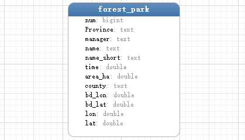

#  数据分析记录

#### 数据采集：

​    使用`Python` 的`requests`框架进行网络数据爬取。最后存入`MySQL`数据库。

#### 数据清洗：

​    使用`JAVA` 的 `MapReduce`框架对采集数据进行清洗

#### 数据可视化：

​    后端使用`Python3.7`的`Flask`框架，返回数据统一为`JSON`对象。

​    前端可视化为 `ECharts`。

## 一、分析国家森林公园数据

主机地址：`192.168.23.102`

数据库端口：`6603`

数据库类型：`MySQL`

数据库名称：`data_data_analytics`

数据表：`forest_park`

数据表字段说明(共12个字段)：

| num    | Province | manager      | name | name_short | time     | area_ha        | county    | bd_lon | bd_lat | lon    | lat    |
| ------ | -------- | ------------ | ---- | ---------- | -------- | -------------- | --------- | ------ | ------ | ------ | ------ |
| 标号   | 省份     | 管理行政单位 | 名称 | 简称       | 创建时间 | 面积（万公顷） | 所在县/市 | bd经度 | bd纬度 | 经度   | 纬度   |
| bigint | text     | text         | text | text       | double   | double         | text      | double | double | double | double |

数据表结构图：

#### Part 1: 分析山东省所有的公园面积，通过柱状图展示

#### Part2: 分析山东省前5大小的公园，通过折线图展示

#### Part3: 分析一下各地区的最大森林公园，并用饼图展示

- 山东
- 福建
- 贵州
- 浙江
- 北京